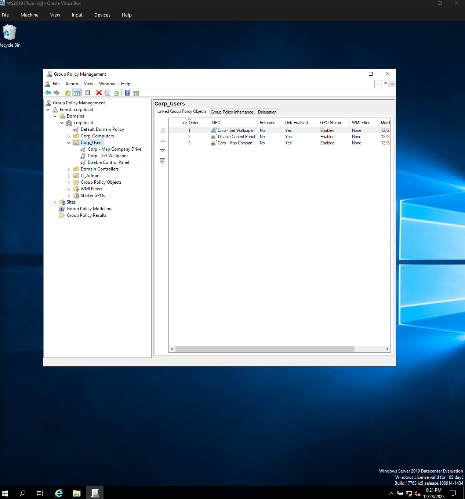
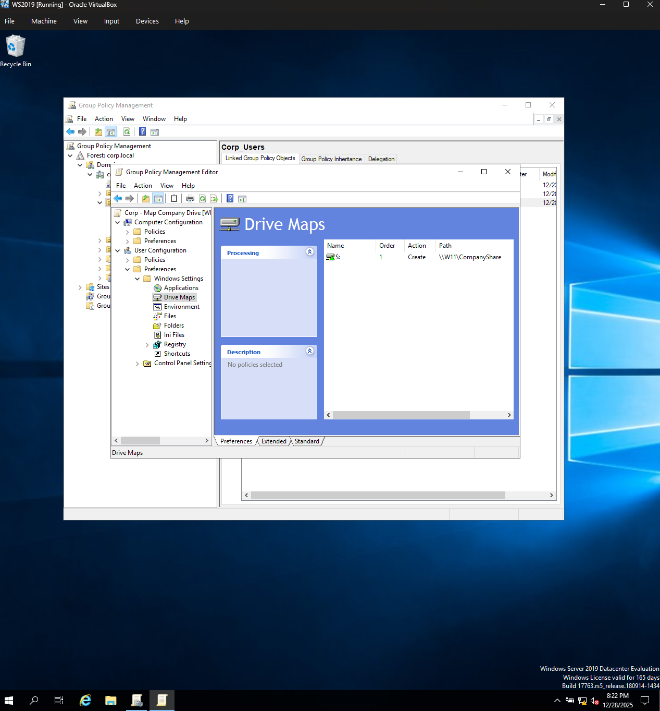

# Active Directory Homelab

## Overview
This project documents a Windows Active Directory homelab built to practice real-world system administration tasks such as domain management, Group Policy configuration, and network drive mapping.

## Environment
- Windows Server 2019 (Domain Controller)
- Windows 11 (Domain-joined client)
- Active Directory Domain: corp.local
- VirtualBox (Internal Network)

## Objectives
- Create and manage Active Directory users and OUs
- Join a Windows 11 machine to the domain
- Apply Group Policy Objects (GPOs)
- Map a network drive using Group Policy Preferences

---

## Project: Mapping a Network Drive via Group Policy

### Goal
Automatically map a shared company drive (S:) for domain users when they log in.

### Configuration Summary
- Share location: `\\W11\CompanyShare`
- Drive letter: `S:`
- GPO applied to: `Corp_Users` OU
- Policy type: User Configuration → Preferences → Drive Maps

### Steps Performed
1. Created a shared folder (`CompanyShare`) on Windows 11
2. Configured NTFS and share permissions
3. Created a GPO to map the drive
4. Linked the GPO to the `Corp_Users` OU
5. Verified drive mapping as a domain user

### Validation
- Logged in as domain user
- Confirmed mapped drive appears under Network Locations
- Verified access to shared folder

### Troubleshooting & Lessons Learned
- Clarified difference between local drives and mapped network drives
- Corrected UNC path usage
- Confirmed GPO scope and user OU placement

---

## Skills Demonstrated
- Active Directory administration
- Group Policy configuration
- Windows networking
- Troubleshooting authentication and policy issues

## Group Policy Drive Mapping Evidence

### GPO Linked to Users OU

### Drive Mapping Configuration

### Result on Domain User

